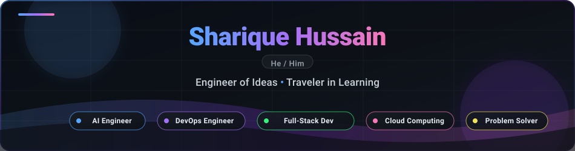

  

  
  &nbsp;
  
  &nbsp;
  
  &nbsp;
  
  &nbsp;
  

 

### 👨‍💻 About Me

👋 Hi there! I'm **[Sharique Hussain](https://www.linkedin.com/in/shariquehussain02/)** *(He/Him)*.

> **Engineer of Ideas | Traveler in Learning | AI Engineer | DevOps Engineer | Full-Stack Developer | Cloud Computing | Problem Solver**

I engineer end-to-end intelligent systems, ranging from autonomous **Agentic AI systems** with multi-step reasoning to high-performance full-stack architectures and cloud-native microservices.

- 💡 **Engineer of Ideas & Problem Solver**: Turning complex real-world challenges into elegant, highly scalable, and reliable software solutions.
- 🤖 **AI & Agentic Systems**: Architecting autonomous agents with plan-act loops, dynamic tool calling, RAG pipelines, and persistent vector memory.
- ⚙️ **Full-Stack & Backend Engineering**: Designing robust RESTful APIs, distributed microservices, and interactive modern user experiences.
- ☁️ **DevOps & Cloud Computing**: Containerizing distributed systems with Docker, orchestrating CI/CD pipelines, deploying on cloud/Linux environments, and ensuring observability with Prometheus & Grafana.
- 🧭 **Traveler in Learning**: Continuously exploring cutting-edge paradigms in Machine Learning, System Design, and advanced Data Structures & Algorithms.

---

### 🛠️ Tech Stack

<table>
  <tr>
    <td width="20%"><strong>Languages</strong></td>
    <td>
      
      
      
      
      
      
      
      
    </td>
  </tr>
  <tr>
    <td><strong>AI & Agentic Systems</strong></td>
    <td>
      
      
      
      
      
    </td>
  </tr>
  <tr>
    <td><strong>Backend & Frameworks</strong></td>
    <td>
      
      
      
      
    </td>
  </tr>
  <tr>
    <td><strong>Frontend</strong></td>
    <td>
      
      
      
    </td>
  </tr>
  <tr>
    <td><strong>Databases & Caching</strong></td>
    <td>
      
      
      
    </td>
  </tr>
  <tr>
    <td><strong>DevOps & Cloud</strong></td>
    <td>
      
      
      
      
      
      
      
    </td>
  </tr>
</table>

---

### 🔥 Featured Projects

| Project | Description | Core Stack | Links |
|:---|:---|:---|:---:|
| 🤖 **CARE** | **Customer Autonomous Resolution Engine** — An autonomous Agentic AI system engineered for multi-step reasoning, plan-act decision making, and automated support ticket resolution. | `Python` `FastAPI` `LangChain` `Docker` | [**Repo**](https://github.com/Sharique002/CARECustomerAutonomousResolutionEngineSharique022) |
| 📚 **Study4You** | **Agentic Study Planner** — Autonomous curriculum agent utilizing a plan-act loop, dynamic tool integration, and long-term memory for personalized study roadmaps. | `Python` `Agentic AI` `LLM Memory` `Tools` | [**Repo**](https://github.com/Sharique002/T24-Study-Planner-Agent_MSH) |
| 🔬 **ScholarLens** | **AI Literature Intelligence** — Automated scientific paper parsing, semantic retrieval, and document intelligence pipeline for rapid research synthesis. | `Python` `NLP` `Embeddings` `Vector Search` | [**Repo**](https://github.com/Sharique002/Scholar_Lens) |
| 🧠 **reBorn_i** | **Hiring Probability Intelligence** — Machine-assisted recruitment intelligence platform evaluating candidate match potential via semantic vector comparison. | `TypeScript` `React` `Node.js` `AI Scoring` | [**Repo**](https://github.com/Sharique002/reBorn_i) |
| 📊 **PulseWat** | **Observability & Telemetry Lab** — Distributed monitoring infrastructure featuring real-time metric scraping, alerting thresholds, and system health dashboards. | `Docker` `Prometheus` `Grafana` `Linux` | [**Repo**](https://github.com/Sharique002/PulseWat) |
| 🌐 **Portfolio** | **Personal Engineering Space** — Production portfolio featuring full-stack architecture overviews, project demos, and technical achievements. | `Next.js` `React` `Tailwind` `Vercel` | [**Repo**](https://github.com/Sharique002/Portfolio) • [**Live**](https://shariqueportfolio.vercel.app) |

---

### 🏆 Achievements & Certifications

- 🥇 **Agentic AI Hackathon 2026** — Selected among **2,000+ global builders**; architected and demonstrated **CARE**.
- 🎓 **Oracle Certified AI Foundations Associate** — Foundations of AI, Machine Learning, and Neural Networks.
- 🐧 **Linux for Developers** — The Linux Foundation.
- ☁️ **Cloud Computing** — NPTEL / IIT Kharagpur.
- 🌐 **The Bits and Bytes of Computer Networking** — Google.
- 💻 **Software Engineer Certificate** — HackerRank.

---

### 📊 GitHub Analytics

  

 

  
  &nbsp;&nbsp;
  

---

### 🐍 Contribution Activity

  <picture>
    <source media="(prefers-color-scheme: dark)" srcset="https://raw.githubusercontent.com/Sharique002/Sharique002/output/github-contribution-grid-snake-dark.svg" />
    <source media="(prefers-color-scheme: light)" srcset="https://raw.githubusercontent.com/Sharique002/Sharique002/output/github-contribution-grid-snake.svg" />
    
  </picture>

---

  
<i>"Building intelligent systems, one problem at a time."</i>

  Designed & engineered with precision by <strong>Sharique Hussain</strong>

